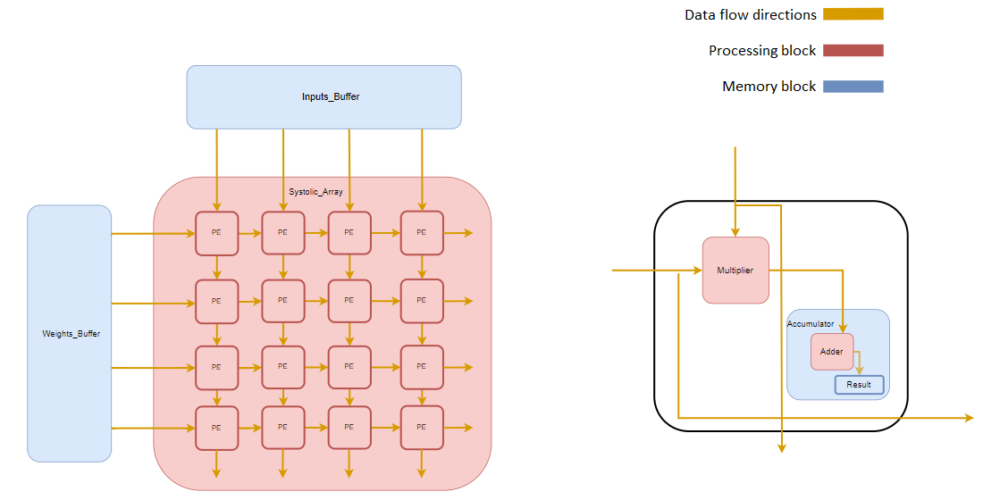

# Systolic-Array-Output-Stationary
This is a Systolic Array project for Vivado Xilinx written in the SystemVerilog language. Systolic array has Output Stationary dataflow. You can use my project for further development of DNN accelerator.
The project consists of 7 modules: Systolic_Array, Inputs_Buffer, Weights_Buffer, PE, Multiplier, Accumulator, Adder. Each module, except Accumulator, has a testbench.

The project has such parameters as MATRIX_SIZE and DATA_WIDTH. The project can work with both negative and positive inputs.
At this stage, the project does not have the ability to multiply numbers with a DATA_WIDTH parameter greater than 8 bits.
